<!--
  BUKU PANDUAN PENGGUNAAN — DASHBOARD DATA DAERAH
  Status : DRAF v0.2 — seluruh fitur login sudah diverifikasi langsung (9 Juli 2026).
  Konvensi:
  - Tangkapan layar tersimpan di asset/ (gambar-x-y-....png); username akun diredaksi (blur).
  - Bagian "Riwayat Revisi" TIDAK diikutkan pada ekspor Google Docs/PDF final (permintaan user).
  - Ekspor PDF final: pandoc / Google Docs; daftar isi & nomor halaman digenerate ulang saat ekspor.
-->

# BUKU PANDUAN PENGGUNAAN

## Dashboard Data Daerah

**data-daerah.databoks.id**

| | |
|---|---|
| Versi Dokumen | 0.2 (Draf) |
| Tanggal | Juli 2026 |
| Disusun oleh | Katadata Databoks |
| Diperuntukkan bagi | Pemerintah Daerah (Pemda) |

<!-- TODO: logo Katadata Databoks + logo pemda pada sampul PDF final -->

---

## Riwayat Revisi

<!-- CATATAN INTERNAL — bagian ini di-skip saat ekspor Google Docs/PDF -->

| Versi | Tanggal | Perubahan | Penyusun |
|---|---|---|---|
| 0.1 | Juli 2026 | Draf awal — fitur publik terdokumentasi; fitur login masih kerangka | Tim IT Katadata |
| 0.2 | 9 Juli 2026 | Verifikasi seluruh fitur login (akun uji): alur Masuk/Keluar, Bandingkan (modal wilayah, 29 indikator, mode Chart/Tabel, Share/CSV/PNG/PDF), Analisis Wilayah AI (12 peran, struktur laporan), halaman Detail Wilayah; bab baru "Panduan Membaca Grafik"; Kamus Data disesuaikan 7 kategori/29 indikator; status Peraturan Daerah (dalam pengembangan); seluruh tangkapan layar final | Tim IT Katadata |

---

## Kata Pengantar

Puji syukur kami panjatkan ke hadirat Tuhan Yang Maha Esa atas tersusunnya Buku Panduan Penggunaan Dashboard Data Daerah ini.

Dashboard Data Daerah merupakan platform penyajian data statistik daerah yang dikembangkan oleh Katadata Databoks untuk membantu pemerintah daerah, investor, dan masyarakat dalam memahami kondisi sosial-ekonomi kabupaten/kota di seluruh Indonesia. Buku panduan ini disusun sebagai pedoman bagi pengguna, khususnya aparatur pemerintah daerah, dalam mengoperasikan seluruh fitur dashboard — mulai dari menjelajah data wilayah, membandingkan antar-daerah, membaca profil lengkap satu wilayah, hingga memanfaatkan laporan analisis berbasis kecerdasan buatan (AI).

Kami berharap buku panduan ini dapat membantu pengguna memanfaatkan Dashboard Data Daerah secara optimal sebagai dasar pengambilan keputusan berbasis data. Saran dan masukan untuk penyempurnaan buku panduan ini sangat kami harapkan.

Jakarta, Juli 2026

**Tim Penyusun — Katadata Databoks**

---

## Daftar Isi

- [Bab 1 — Pendahuluan](#bab-1--pendahuluan)
- [Bab 2 — Deskripsi Umum Sistem](#bab-2--deskripsi-umum-sistem)
- [Bab 3 — Petunjuk Penggunaan](#bab-3--petunjuk-penggunaan)
- [Bab 4 — Panduan Membaca Grafik dan Visualisasi](#bab-4--panduan-membaca-grafik-dan-visualisasi)
- [Bab 5 — Kamus Data dan Definisi Indikator](#bab-5--kamus-data-dan-definisi-indikator)
- [Bab 6 — FAQ dan Penanganan Kendala](#bab-6--faq-dan-penanganan-kendala)
- [Bab 7 — Catatan tentang Analisis AI](#bab-7--catatan-tentang-analisis-ai)
- [Lampiran](#lampiran)

<!-- Daftar isi + daftar gambar dengan nomor halaman digenerate saat ekspor PDF -->

---

# Bab 1 — Pendahuluan

## 1.1 Latar Belakang

Data pembangunan daerah tersebar di berbagai sumber — BPS, DJPK Kementerian Keuangan, Kemendagri, BKPM — dengan format yang berbeda-beda, sehingga merangkum kondisi satu wilayah saja membutuhkan waktu yang tidak sedikit. Dashboard Data Daerah hadir untuk menyatukan data tersebut dalam satu platform yang mudah diakses, dilengkapi visualisasi interaktif dan analisis naratif otomatis, sehingga data dapat lebih cepat menjadi dasar pengambilan keputusan.

## 1.2 Maksud dan Tujuan

Buku panduan ini dimaksudkan sebagai pedoman teknis penggunaan Dashboard Data Daerah. Tujuannya agar pengguna mampu:

1. Mengakses dashboard dan memahami struktur menunya;
2. Menjelajahi data statistik kabupaten/kota dan provinsi;
3. Membandingkan indikator antar-wilayah dan mengunduh hasilnya;
4. Membaca halaman Detail Wilayah beserta seluruh grafiknya secara tepat;
5. Menggunakan fitur Analisis Wilayah berbasis AI dan memahami struktur laporannya;
6. Memahami definisi, sumber, dan keterbatasan setiap indikator yang disajikan.

## 1.3 Ruang Lingkup

Buku ini mencakup seluruh fitur Dashboard Data Daerah, yang terbagi atas:

- **Fitur publik** (tanpa login): Beranda, Jelajah Daerah, Bandingkan (wilayah terbatas), Kenapa DataDaerah?
- **Fitur pengguna terdaftar** (memerlukan login): halaman **Detail Wilayah** (profil lengkap satu kabupaten/kota) dan **Analisis Wilayah (AI)**.
- Menu **Peraturan Daerah** saat ini masih dalam tahap pengembangan (lihat sub-bab 3.7).

Buku ini **tidak** mencakup panduan administrasi sistem (pengelolaan konten/CMS) yang hanya digunakan oleh pengelola internal.

## 1.4 Istilah dan Singkatan

Daftar lengkap terdapat pada Lampiran B. Beberapa istilah yang sering muncul:

| Istilah | Arti |
|---|---|
| Dashboard | Halaman penyajian data dalam bentuk grafik, peta, dan tabel interaktif |
| Indikator | Ukuran statistik tertentu, misalnya PDRB, IPM, atau TPT |
| Kab/Kota | Kabupaten/Kota (514 wilayah di Indonesia) |
| Detail Wilayah | Halaman profil lengkap satu kab/kota (disebut juga halaman *persona*) |
| Peringkat | Posisi suatu wilayah dibanding wilayah lain untuk satu indikator, mis. #12/514 |
| AI | Artificial Intelligence / kecerdasan buatan, digunakan untuk menyusun narasi analisis otomatis |

---

# Bab 2 — Deskripsi Umum Sistem

## 2.1 Deskripsi Dashboard

Dashboard Data Daerah adalah aplikasi berbasis web yang menyajikan data statistik sosial-ekonomi seluruh kabupaten/kota dan provinsi di Indonesia. Data bersumber dari lembaga resmi (BPS, DJPK Kemenkeu, Kemendagri, BKPM) dan diperbarui secara otomatis mengikuti rilis masing-masing sumber. Selain penyajian angka, dashboard menyediakan analisis naratif otomatis berbasis AI yang merangkum kekuatan, kelemahan, anomali, dan posisi komparatif tiap wilayah.

## 2.2 Alamat Akses

Dashboard diakses melalui peramban (browser) di alamat:

> **https://data-daerah.databoks.id/**

## 2.3 Persyaratan Penggunaan

Tidak diperlukan instalasi perangkat lunak apa pun. Persyaratan minimal:

| Komponen | Persyaratan |
|---|---|
| Perangkat | Komputer/laptop atau ponsel pintar |
| Peramban | Versi terbaru Google Chrome, Mozilla Firefox, Microsoft Edge, atau Safari |
| Koneksi | Internet stabil (halaman peta dan grafik memuat data secara langsung) |

## 2.4 Jenis Pengguna

| Jenis | Cara akses | Cakupan fitur |
|---|---|---|
| Pengunjung publik | Langsung tanpa login | Beranda, Jelajah Daerah, Bandingkan (wilayah terbatas) |
| Pengguna terdaftar / pemda | Akun (username + password) diberikan oleh pengelola; tersedia pula opsi **Login dengan Katadata** (SSO) | Seluruh fitur, termasuk Detail Wilayah dan Analisis Wilayah (AI) |

Akun pemda dikaitkan dengan wilayah tertentu: setelah masuk, pengguna langsung diarahkan ke halaman Detail Wilayah kabupaten/kota yang bersangkutan.

<!-- TODO (tim): konfirmasi skema penerbitan akun pemda (satu akun per OPD atau per instansi, masa berlaku) untuk dicantumkan di sini -->

---

# Bab 3 — Petunjuk Penggunaan

> Setiap sub-bab disusun sebagai langkah bernomor. Ikuti langkah secara berurutan. Tangkapan layar diberi nomor (Gambar 3.x) dan merujuk pada tampilan aplikasi per Juli 2026. Contoh pada buku ini menggunakan **Kota Semarang** dan **Kota Surakarta** sebagai wilayah rujukan.

## 3.1 Mengakses Dashboard dan Mengenal Halaman Beranda

1. Buka peramban, ketik alamat **https://data-daerah.databoks.id/**, lalu tekan Enter.
2. Halaman Beranda akan tampil dengan bagian-bagian berikut:
   - **Menu navigasi** (atas): Beranda, Jelajah Daerah, Bandingkan, Kenapa DataDaerah?, Peraturan Daerah, dan tombol **Masuk**.
   - **Empat kartu statistik ringkas** berisi angka utama terkini: Pertumbuhan PDB, Populasi, Investasi Asing, dan jumlah Daerah Otonom.
   - **Peta interaktif Indonesia**: arahkan kursor ke suatu wilayah untuk melihat namanya; klik untuk menuju halaman datanya. Gunakan tombol +/− untuk memperbesar/memperkecil peta.

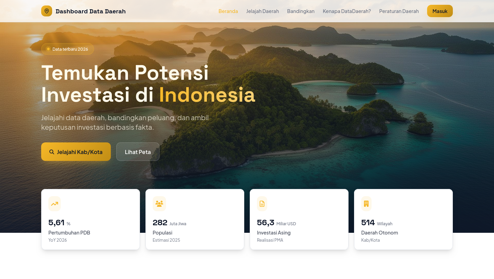

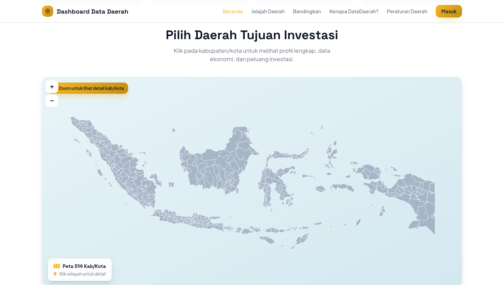

## 3.2 Masuk (Login) dan Keluar (Logout)

1. Klik tombol **Masuk** di pojok kanan atas.
2. Halaman *Secure Authentication Portal* akan tampil. Isi **Username** dan **Password** yang diberikan pengelola, lalu klik **Masuk ke Dashboard**. Sebagai alternatif, pengguna yang memiliki akun Katadata dapat memilih **Login dengan Katadata** (single sign-on).
3. Setelah berhasil masuk, Anda langsung diarahkan ke halaman **Detail Wilayah** sesuai wilayah akun Anda (mis. akun Pemkot Semarang diarahkan ke halaman Kota Semarang).
4. Nama akun tampil di pojok kanan atas. Klik nama akun untuk membuka menu pengguna yang berisi: **Buka Dashboard**, **Profil Saya**, dan **Keluar**.
5. Untuk mengakhiri sesi, pilih **Keluar** — Anda akan dikembalikan ke halaman Beranda.

> **Lupa password?** Dashboard belum menyediakan fitur atur-ulang password mandiri. Hubungi pengelola melalui kontak dukungan (Bab 6) untuk penggantian password.

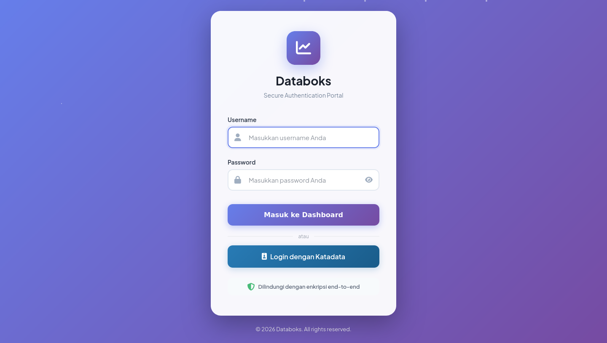

## 3.3 Jelajah Daerah

Menu **Jelajah Daerah** digunakan untuk menelusuri data per wilayah.

1. Klik menu **Jelajah Daerah** pada navigasi atas.
2. Pilih cakupan wilayah:
   - **Semua Wilayah / Semua Kabupaten/Kota**, atau
   - Saring per pulau: **Sumatera, Jawa, Kalimantan, Sulawesi, Bali & Nusa Tenggara, Maluku & Papua**.
3. Bagian **Temukan Isu Menarik** menampilkan sorotan isu terkini; klik **Detail Isu** untuk membuka penjelasan lengkapnya.
4. Daftar wilayah ditampilkan berikut peringkatnya; gulir ke bawah untuk melihat urutan berikutnya.
5. Klik nama wilayah untuk membuka halaman data wilayah tersebut.

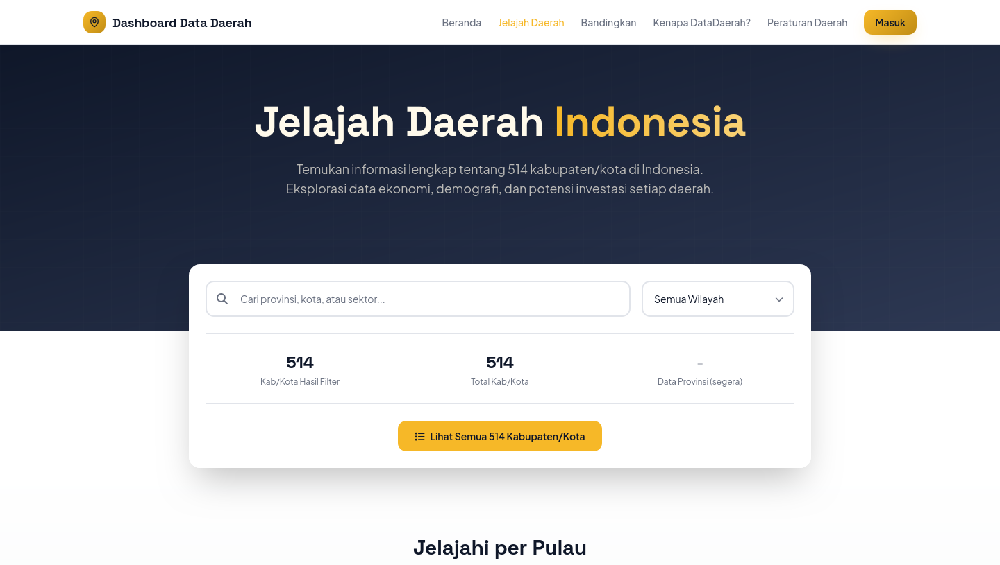

## 3.4 Membandingkan Wilayah

Menu **Bandingkan** menyandingkan hingga 29 indikator dari dua wilayah atau lebih secara berdampingan.

1. Klik menu **Bandingkan** pada navigasi atas.
2. Klik tombol **+ Wilayah**. Jendela **Pilih Wilayah untuk Dibandingkan** akan terbuka:
   - Ketik nama kabupaten/kota pada kotak pencarian (mis. "Kota S"), atau saring daftar per **Pulau** / **Provinsi**;
   - **Centang** kartu wilayah yang ingin dibandingkan — dapat lebih dari dua. Tersedia pula tombol **Pilih Semua** dan **Hapus Semua**;
   - Klik tombol **Bandingkan · N wilayah** untuk menampilkan hasil.
3. Wilayah terpilih tampil sebagai *chip* di bilah atas; klik tanda **×** pada chip untuk mengeluarkan satu wilayah, atau **Reset** untuk mengulang dari awal.
4. Secara bawaan seluruh **29 indikator** dalam 7 kategori ikut dibandingkan. Klik tombol **(29/29)** untuk memilih hanya kategori/indikator tertentu.
5. Hasil perbandingan pertama kali tampil dalam **mode tabel**. Klik tombol **Chart** untuk berpindah ke mode grafik, dan **Tabel** untuk kembali. Cara membaca kedua mode dijelaskan pada sub-bab 4.8.
6. Panel kecil **"Wilayah Dibandingkan"** di kanan bawah mencantumkan wilayah aktif; klik nama wilayah untuk membuka halaman Detail Wilayah-nya di tab baru.
7. Untuk membagikan atau menyimpan hasil:
   - **Share** — menyalin tautan halaman ke clipboard; tautan merekam konfigurasi perbandingan Anda sehingga penerima melihat tampilan yang sama;
   - **CSV** — mengunduh data perbandingan dalam format tabel (dapat dibuka di Excel);
   - **PNG** — mengunduh tampilan sebagai gambar;
   - **PDF** — mengunduh tampilan sebagai dokumen PDF.
8. Tombol **Diskusi** di pojok kanan bawah membuka panel komentar untuk berdiskusi mengenai hasil perbandingan dengan sesama pengguna.

> **Catatan:** sebagian wilayah hanya dapat dibandingkan oleh pengguna terdaftar. Masuk terlebih dahulu (sub-bab 3.2) apabila wilayah yang Anda cari tidak tersedia.

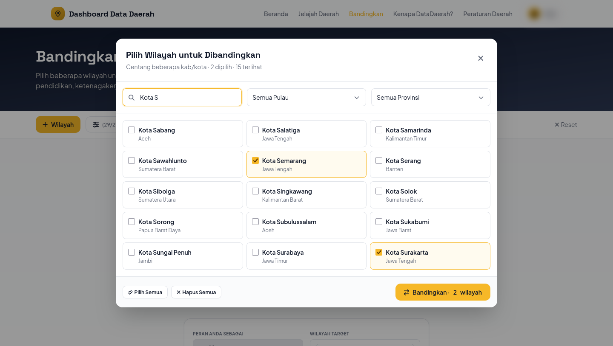

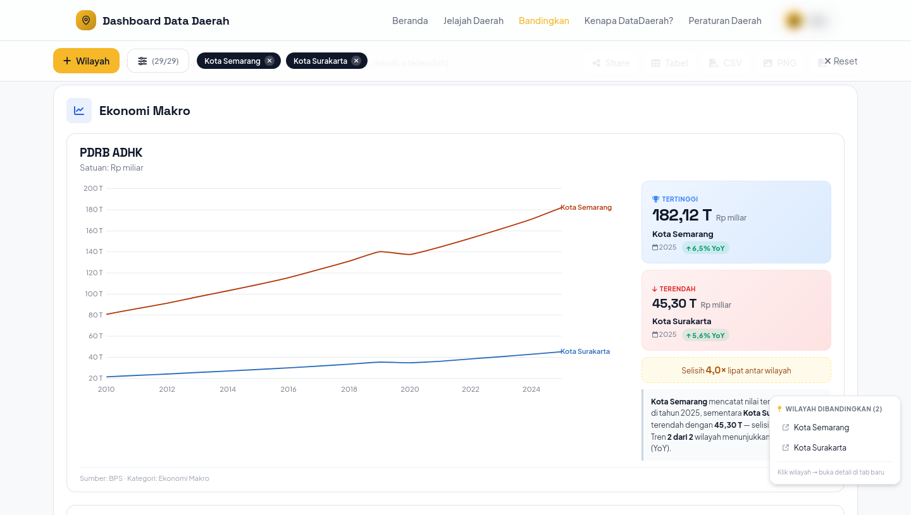

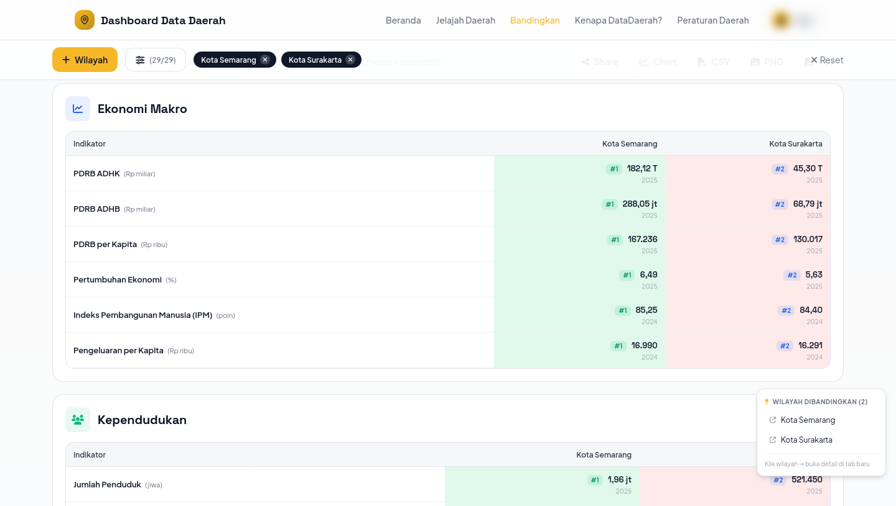

## 3.5 Analisis Wilayah (AI)

Fitur ini menghasilkan laporan analisis naratif otomatis untuk satu wilayah. **Memerlukan login.**

1. Masuk terlebih dahulu (sub-bab 3.2), lalu buka menu **Bandingkan** dan gulir ke bagian **Mulai Analisis Wilayah**. (Fitur yang sama juga dapat dipanggil dari tombol **Buat Analisis AI** yang selalu tampil di bagian bawah halaman Detail Wilayah.)
2. Pada **PERAN ANDA SEBAGAI**, pilih salah satu dari 12 peran. AI menyesuaikan gaya bahasa dan fokus analisis dengan peran yang dipilih — misalnya ringkasan kebijakan untuk kepala daerah dan keluaran teknokratis untuk Bappeda:
   1. Kepala Daerah (Bupati/Walikota)
   2. Bappeda (Perencana Pembangunan)
   3. Dinas Penanaman Modal
   4. Dinas Sosial
   5. Dinas Ketenagakerjaan
   6. Inspektorat (Pengawas Internal)
   7. Investor / Pelaku Bisnis
   8. Peneliti / Akademisi
   9. Jurnalis Data
   10. Anggota DPRD / Pengawas Legislatif
   11. Warga / Masyarakat Umum
   12. Konsultan Pembangunan / Strategi
3. Pada **WILAYAH TARGET**, ketik dan pilih kabupaten/kota yang akan dianalisis.
4. Klik **Buat Analisis AI**. Proses analisis umumnya selesai dalam 30–60 detik (paling lama ± 2 menit); halaman laporan terbuka otomatis dan menampilkan penanda **"Analisis AI siap!"**.
5. Laporan (halaman *Report*) tersusun atas dua bagian besar:
   - **Data komparatif per kategori** — mengikuti panel *Outline* di sisi kiri (Ekonomi Makro, Kependudukan, Kesehatan, Pendidikan, Ketenagakerjaan, Kemiskinan & Ketimpangan, Keuangan Daerah). Setiap kategori memuat narasi *insight*, kartu tiap indikator dengan peringkat wilayah (mis. #12/516 kabkota, #1/35 se-provinsi), dan daftar 5 wilayah teratas sebagai pembanding;
   - **Analisis AI** — dapat dituju langsung lewat tombol **Lompat ke Analisis AI**, berisi: *Executive Insight* (rangkuman utama), *Key Findings* (temuan bernomor beserta implikasinya), *Diagnostic* (telaah lintas indikator), **Analisis SWOT** (Strengths, Weaknesses, Opportunities, Threats), *Posisi Komparatif*, **Anomali/Kontradiksi Data** (nilai yang saling bertentangan antar-indikator), *Indikator Highlight*, *Strategic Imperatives* (rekomendasi tindakan), dan **Pertanyaan untuk Eksplorasi** (Q1–Q3) yang bila diklik akan memilihkan indikator dan menampilkan datanya.
6. Hasil analisis tersimpan (cache) sehingga kunjungan berikutnya untuk wilayah dan peran yang sama tampil seketika. Gunakan tautan **Pilih role lain** atau **regenerate** di bagian bawah laporan untuk menyusun ulang analisis.

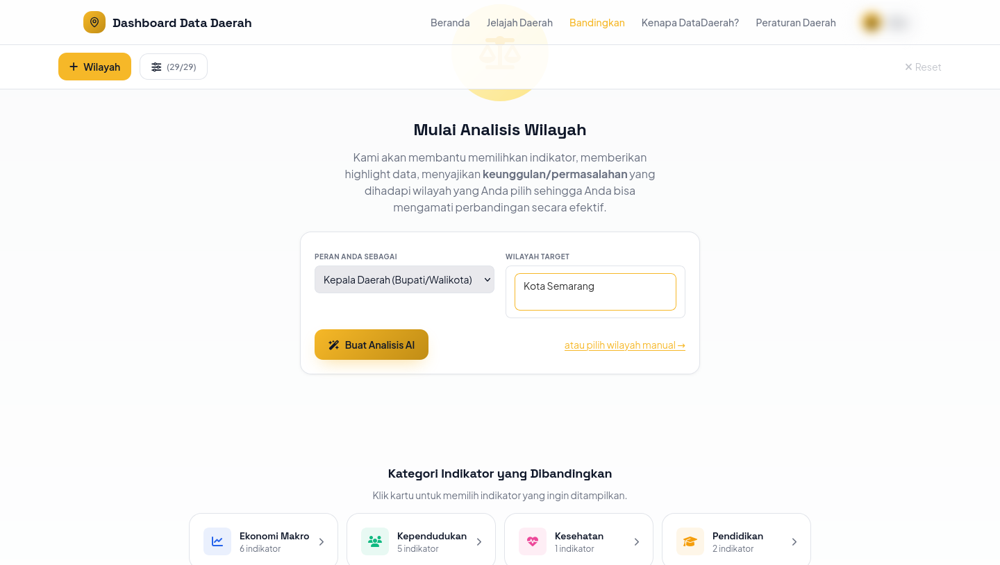

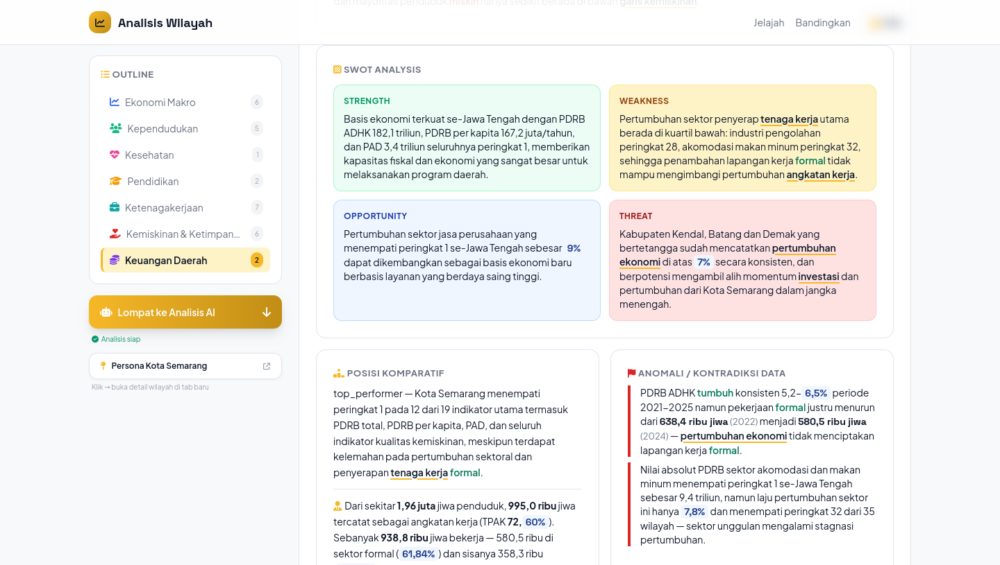

## 3.6 Halaman Detail Wilayah

Halaman Detail Wilayah menyajikan profil lengkap satu kabupaten/kota. **Memerlukan login.** Halaman ini terbuka otomatis setelah login, atau melalui klik nama wilayah pada peta Beranda, hasil Jelajah Daerah, panel "Wilayah Dibandingkan", maupun tautan **Persona** pada laporan AI.

1. Bagian kepala halaman menampilkan nama wilayah, provinsi, dan menu **Ganti wilayah** untuk berpindah ke kabupaten/kota lain.
2. Navigasi bagian (atas) memuat 12 seksi: **Profil, Data Umum, Ekonomi, Investasi, SDM, Ketenagakerjaan, Kependudukan, Stabilitas, Kemiskinan, Tata Kelola, Anggaran, Infrastruktur**. Klik salah satu untuk melompat langsung ke seksi tersebut.
3. Isi tiap seksi:
   - **Profil** — narasi ringkas kondisi wilayah, peta lokasi, dan empat kartu angka utama (PDRB ADHK, Jumlah Penduduk, PDRB per Kapita, Laju Pertumbuhan Ekonomi);
   - **Data Umum** — kepala daerah, ibukota, koordinat, situs web, alamat, dan kode pos;
   - **Ekonomi** — grafik Pertumbuhan Ekonomi & Proyeksi (3 skenario), PDRB per sektor, distribusi/kontribusi sektor, dan tabel PDRB lapangan usaha;
   - **Investasi** — investasi per lapangan usaha, distribusinya, jumlah usaha, dan perbandingan dengan UMP;
   - **SDM & Ketenagakerjaan** — komposisi usia produktif, pendidikan, TPAK/TPT, struktur dan serapan tenaga kerja, jam kerja, produktivitas;
   - **Kependudukan** — piramida penduduk dan grafik sebar Umur Harapan Hidup vs PDRB per Kapita;
   - **Stabilitas & Kemiskinan** — jumlah penduduk per kelas ekonomi, gini rasio, P1/P2, kartu tren indikator kemiskinan, dan narasi *insight*;
   - **Tata Kelola & Anggaran** — PAD vs Total Belanja, Derajat Otonomi Fiskal, diagram alir APBD, Dana Bagi Hasil, dan Belanja Kemiskinan;
   - **Infrastruktur** — kartu statistik fasilitas (rumah sakit, sekolah, pasar, jalan, dan lain-lain).
4. Cara membaca setiap jenis grafik pada halaman ini dijelaskan pada **Bab 4**.

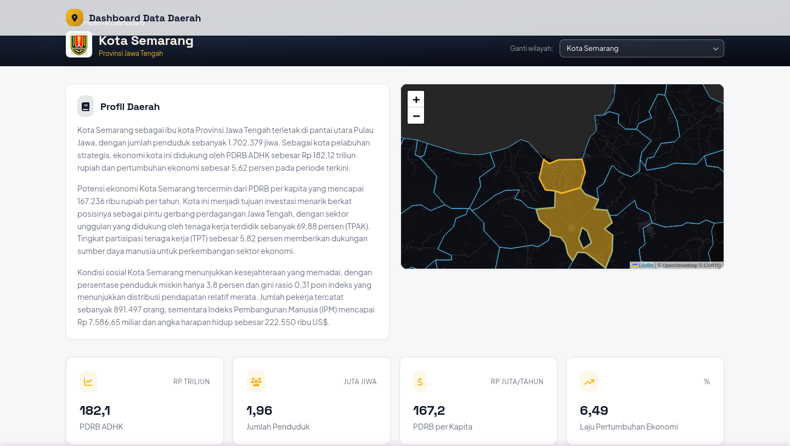

## 3.7 Peraturan Daerah

Menu **Peraturan Daerah** disiapkan untuk memuat koleksi regulasi daerah. Per Juli 2026 fitur ini **masih dalam tahap pengembangan** dan belum dapat diakses — menu akan mengarahkan pengguna ke halaman Masuk. Petunjuk penggunaannya akan ditambahkan pada revisi buku panduan berikutnya setelah fitur dirilis.

## 3.8 Membagikan dan Menyimpan Hasil

1. **Membagikan tampilan perbandingan**: klik **Share** pada halaman Bandingkan — tautan yang tersalin merekam pilihan wilayah dan indikator, sehingga penerima melihat tampilan yang sama. Tempel (paste) tautan tersebut ke WhatsApp, surel, atau media lain.
2. **Menyimpan untuk laporan**: gunakan tombol **CSV** (data mentah untuk diolah di Excel), **PNG** (gambar untuk bahan paparan), atau **PDF** (dokumen siap cetak) pada halaman Bandingkan.
3. **Menyimpan laporan AI**: laporan Analisis Wilayah belum memiliki tombol unduh; gunakan fitur cetak peramban (Ctrl+P → *Save as PDF*) apabila diperlukan salinan dokumen.

---

# Bab 4 — Panduan Membaca Grafik dan Visualisasi

Bab ini menjelaskan cara membaca setiap jenis grafik yang digunakan dashboard, terutama pada halaman Detail Wilayah. Contoh menggunakan data Kota Semarang; tampilan untuk kabupaten/kota lain sama, hanya berbeda angka.

## 4.1 Kartu Indikator dan Peringkat

Kartu indikator adalah elemen yang paling sering dijumpai. Satu kartu memuat satu indikator.

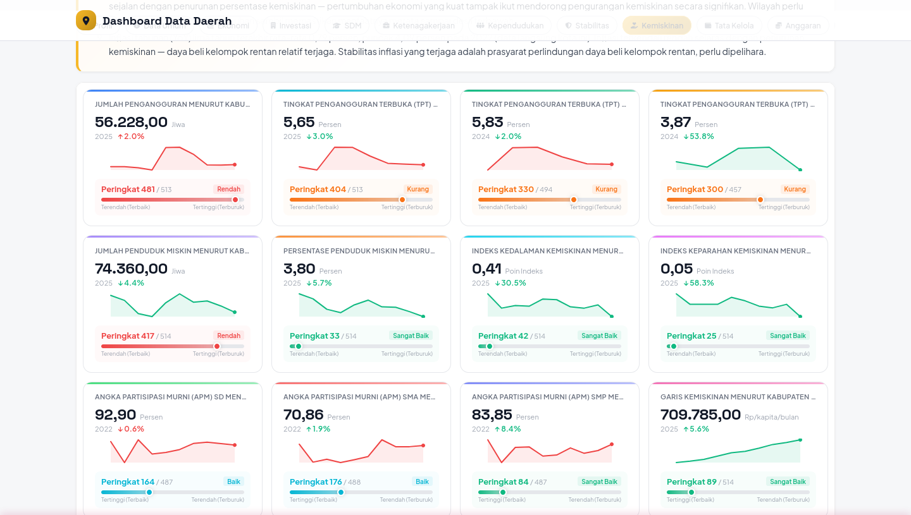

Cara membacanya:

1. **Angka besar** = nilai terkini indikator, diikuti satuannya (persen, jiwa, rupiah, poin indeks). Tahun data tercantum di bawah angka.
2. **Panah dan persentase** di samping tahun = perubahan terhadap tahun sebelumnya (YoY). Panah naik berarti nilai bertambah — perhatikan bahwa "naik" tidak selalu "membaik" (mis. pengangguran naik justru memburuk).
3. **Grafik garis kecil** (*sparkline*) = tren nilai beberapa tahun terakhir. Warna hijau menandakan tren yang dinilai membaik, merah memburuk.
4. **Peringkat N / total** = posisi wilayah dibanding seluruh kab/kota yang memiliki data (mis. Peringkat 33/514). Label kualitas di sebelahnya merangkum posisi tersebut: **Sangat Baik** (kelompok terbaik), **Baik**, **Cukup**, **Kurang**, hingga **Rendah** (kelompok terburuk).
5. **Bilah posisi** di bawah peringkat menunjukkan letak wilayah pada rentang seluruh wilayah. Perhatikan keterangan ujungnya: untuk indikator yang "semakin kecil semakin baik" (mis. TPT, kemiskinan), ujung kiri bertuliskan *Terendah (Terbaik)*; untuk indikator yang "semakin besar semakin baik" (mis. APM), ujung kiri bertuliskan *Tertinggi (Terbaik)*.

## 4.2 Grafik Garis Tren dan Proyeksi

Digunakan antara lain pada **Pertumbuhan Ekonomi & Proyeksi** (seksi Ekonomi).

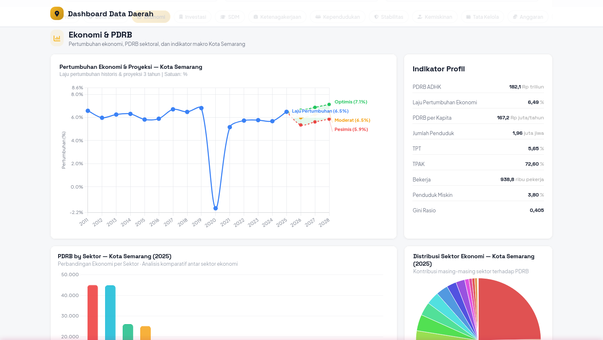

Cara membacanya:

1. **Garis biru dengan titik** = data historis; tiap titik adalah nilai satu tahun. Arahkan kursor ke titik untuk melihat angkanya.
2. Setelah tahun terakhir, garis bercabang menjadi **proyeksi 3 skenario**: **Optimis** (hijau), **Moderat** (kuning), dan **Pesimis** (merah), masing-masing dengan angka perkiraannya.
3. **Lebar rentang** antara skenario Optimis dan Pesimis menggambarkan tingkat ketidakpastian: semakin lebar, semakin besar ketidakpastiannya — gunakan skenario Moderat sebagai baseline perencanaan dan siapkan rencana cadangan untuk skenario Pesimis.

## 4.3 Grafik Batang Bertumpuk (Stacked Bar)

Digunakan antara lain pada **Jumlah Penduduk per Kelas Ekonomi** (seksi Stabilitas).

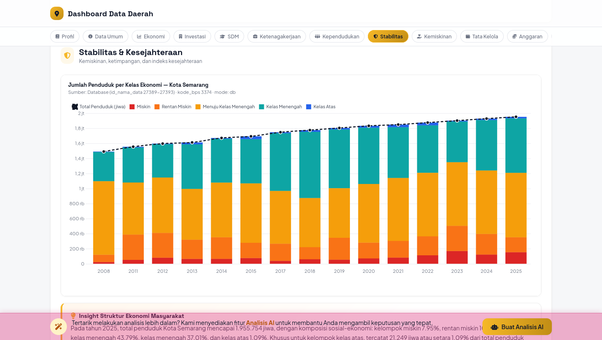

Cara membacanya:

1. Satu batang = satu tahun. **Tinggi total batang** = jumlah penduduk keseluruhan; **garis putus-putus** menegaskan tren totalnya.
2. **Warna dalam batang** membagi total menjadi kelompok (legenda di atas grafik): Miskin, Rentan Miskin, Menuju Kelas Menengah, Kelas Menengah, Kelas Atas.
3. Bandingkan proporsi warna antar-tahun untuk melihat pergeseran komposisi — misalnya segmen merah (Miskin) yang menyempit menandakan penurunan kemiskinan, terlepas dari total penduduk yang bertambah.

## 4.4 Grafik Sebar (Scatter/Bubble antar-Wilayah)

Digunakan pada **Umur Harapan Hidup vs PDRB per Kapita** (seksi Kependudukan).

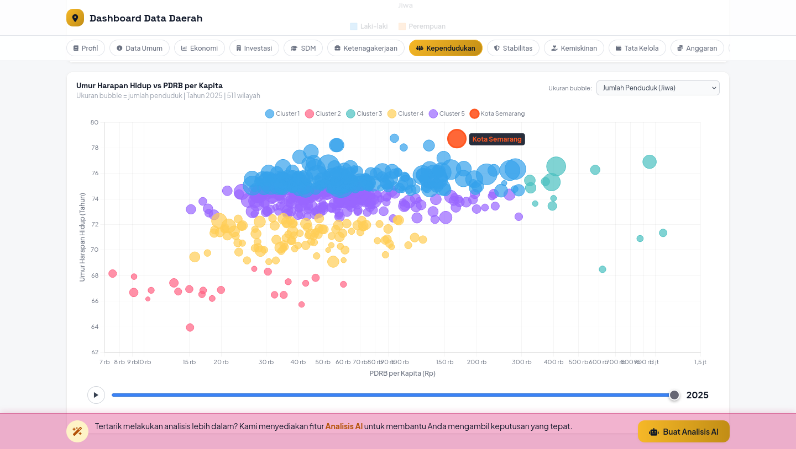

Cara membacanya:

1. Setiap **lingkaran = satu kabupaten/kota** (511 wilayah). Sumbu mendatar = PDRB per Kapita; sumbu tegak = Umur Harapan Hidup. Posisi kanan-atas berarti sejahtera secara ekonomi sekaligus panjang umur.
2. **Ukuran lingkaran** mengikuti pilihan menu "Ukuran bubble" (bawaan: Jumlah Penduduk) — lingkaran besar berarti penduduk banyak.
3. **Warna** menandakan kelompok (cluster) wilayah yang karakteristiknya mirip; **wilayah Anda disorot oranye** dengan label nama.
4. Geser **slider tahun** di bawah grafik, atau klik tombol putar (▶) untuk melihat animasi pergerakan seluruh wilayah dari tahun ke tahun.

## 4.5 Grafik Ukur (Gauge) Fiskal

Digunakan pada **Derajat Otonomi Fiskal (DOF)** dan **Indeks Kapasitas Fiskal Daerah** (seksi Anggaran).

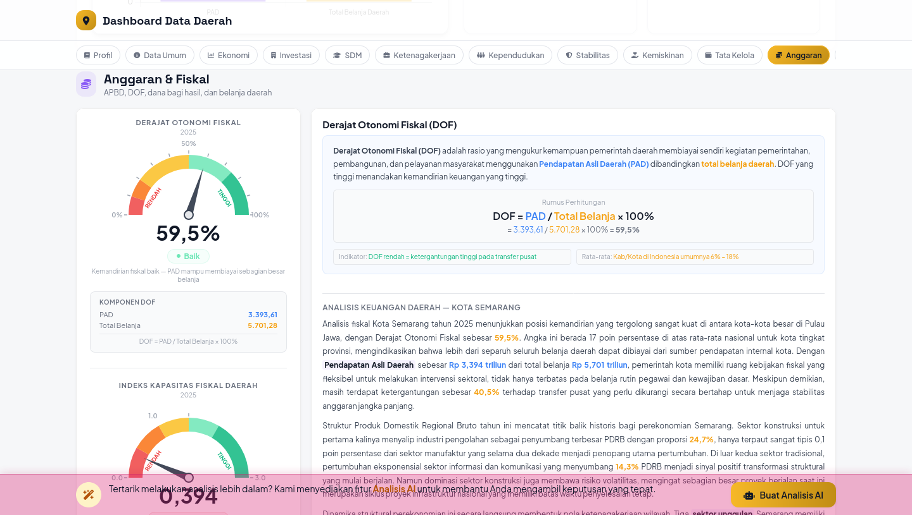

Cara membacanya:

1. **Jarum** menunjuk nilai wilayah pada busur berwarna dari zona merah (**Rendah**) ke zona hijau (**Tinggi**); label di bawah angka (mis. "Baik") merangkum posisinya.
2. DOF dihitung dengan rumus **DOF = PAD / Total Belanja × 100%** — semakin tinggi, semakin mandiri keuangan daerah (semakin kecil ketergantungan pada transfer pusat). Sebagai pembanding, rata-rata kab/kota di Indonesia berkisar 6–18%.
3. Panel **Komponen** di bawah gauge merinci angka pembentuknya (PAD dan Total Belanja), dan panel kanan memuat narasi **Analisis Keuangan Daerah** yang menjelaskan angka tersebut dalam konteks wilayah.

## 4.6 Diagram Alir Anggaran (Sankey APBD)

Digunakan pada **Anggaran Daerah** (seksi Anggaran).

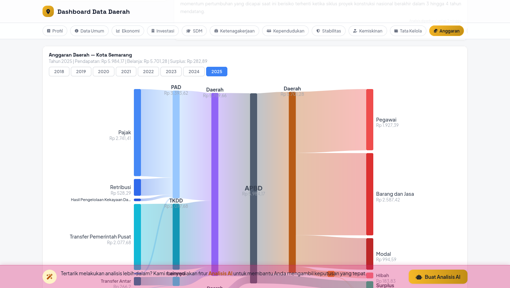

Cara membacanya:

1. Diagram dibaca **dari kiri ke kanan**: sumber pendapatan (Pajak, Retribusi, Hasil Pengelolaan Kekayaan Daerah, Transfer Pemerintah Pusat, Transfer Antar-Daerah, SILPA) mengalir membentuk **PAD**, **TKDD**, dan komponen lainnya, terkumpul menjadi **APBD**, lalu terurai ke pos belanja di kanan (Pegawai, Barang dan Jasa, Modal, Hibah, Surplus).
2. **Lebar pita** sebanding dengan besaran rupiahnya — pita paling lebar adalah aliran dana terbesar. Angka tiap simpul tertera di bawah namanya (dalam Rp miliar).
3. Gunakan **tab tahun** (2018–2025) di atas diagram untuk membandingkan struktur anggaran antar-tahun; baris ringkasan di kepala diagram mencantumkan total Pendapatan, Belanja, dan Surplus/Defisit tahun terpilih.

## 4.7 Grafik Gelembung Belanja (Bubble Chart)

Digunakan pada **Belanja Kemiskinan** (seksi Anggaran).

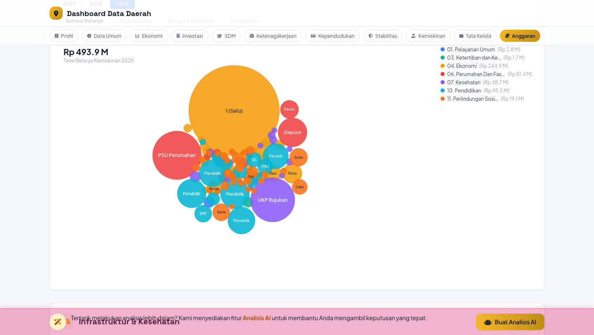

Cara membacanya:

1. Setiap **gelembung = satu program/pos belanja** yang terkait penanggulangan kemiskinan; **ukuran gelembung** sebanding dengan nilai belanjanya. Angka total tercantum di kiri atas.
2. **Warna** mengikuti fungsi anggaran (legenda kanan: Pelayanan Umum, Ketertiban, Ekonomi, Perumahan dan Fasilitas Umum, Kesehatan, Pendidikan, Perlindungan Sosial) beserta nilai totalnya per fungsi.
3. Arahkan kursor ke gelembung untuk melihat nama program dan nilainya. Gunakan **tab tahun** serta tab tampilan (Semua Belanja / Jenis Belanja / Fungsi & Indikator / Perubahan) untuk mengubah sudut pandang.

## 4.8 Grafik dan Tabel Perbandingan Antar-Wilayah

Digunakan pada hasil menu **Bandingkan** (lihat Gambar 3.6 dan 3.7).

**Mode grafik** (Gambar 3.6):

1. Setiap indikator disajikan sebagai **grafik garis multi-wilayah**; satu garis berwarna = satu wilayah (nama di ujung garis).
2. Panel kanan merangkum **nilai Tertinggi** (biru) dan **Terendah** (merah) beserta tahun data dan perubahan YoY, diikuti **selisih** antar-wilayah (mis. "4,0× lipat") dan narasi otomatis.
3. Keterangan **Sumber** data tercantum di kaki setiap grafik.

**Mode tabel** (Gambar 3.7):

1. Baris = indikator (dikelompokkan per kategori); kolom = wilayah.
2. **Warna sel** menunjukkan peringkat dalam baris: **hijau = terbaik**, **merah = terendah** di antara wilayah yang dibandingkan; lencana **#1, #2, …** menegaskan urutannya.
3. **Tahun data** tertera kecil di bawah tiap angka — pastikan membandingkan tahun yang sama; indikator tertentu (mis. IPM) dapat tertinggal satu tahun dari indikator lain.

## 4.9 Elemen Laporan Analisis AI

Pada laporan Analisis Wilayah (sub-bab 3.5) terdapat elemen visual khas berikut:

1. **Lencana peringkat** — mis. `#12/516 kabkota` dan `#1/35 seprovinsi Jateng` pada tiap kartu indikator: posisi wilayah secara nasional dan se-provinsi;
2. **Top Movers** — kartu perubahan paling mencolok (kenaikan/penurunan YoY terbesar) beserta nilainya;
3. **Highlight** — bilah rata-rata perubahan YoY per kelompok indikator; semakin panjang/pekat, semakin besar perubahannya;
4. **Kuadran SWOT** — empat kotak berwarna: hijau (*Strength*), kuning (*Weakness*), biru (*Opportunity*), merah (*Threat*);
5. **Anomali/Kontradiksi Data** — pasangan fakta yang tampak bertentangan (mis. ekonomi tumbuh tetapi pekerjaan formal menurun) yang layak ditindaklanjuti dengan telaah lapangan.

---

# Bab 5 — Kamus Data dan Definisi Indikator

Bab ini menjelaskan definisi, satuan, dan sumber ke-29 indikator perbandingan, mengikuti tujuh kategori pada dashboard. Definisi mengikuti konsep resmi Badan Pusat Statistik (BPS), kecuali disebutkan lain. Halaman Detail Wilayah memuat indikator tambahan (investasi, APBD, infrastruktur) yang sumbernya dicantumkan langsung pada masing-masing grafik.

## 5.1 Ekonomi Makro (6 indikator)

| Indikator | Definisi | Satuan | Sumber |
|---|---|---|---|
| PDRB ADHK | Produk Domestik Regional Bruto Atas Dasar Harga Konstan — nilai tambah bruto seluruh barang dan jasa yang dihasilkan wilayah, dinilai dengan harga tahun dasar, untuk melihat pertumbuhan riil | Rp miliar | BPS |
| PDRB ADHB | PDRB Atas Dasar Harga Berlaku — dinilai dengan harga tahun berjalan | Rp miliar | BPS |
| PDRB per Kapita | PDRB dibagi jumlah penduduk pertengahan tahun | Rp ribu | BPS |
| Pertumbuhan Ekonomi | Persentase perubahan PDRB ADHK terhadap tahun sebelumnya | % | BPS |
| Indeks Pembangunan Manusia (IPM) | Indeks komposit dimensi umur panjang dan hidup sehat, pengetahuan, serta standar hidup layak | poin (0–100) | BPS |
| Pengeluaran per Kapita | Pengeluaran riil per kapita yang disesuaikan (komponen standar hidup layak IPM) | Rp ribu | BPS |

## 5.2 Kependudukan (5 indikator)

| Indikator | Definisi | Satuan | Sumber |
|---|---|---|---|
| Jumlah Penduduk | Banyaknya penduduk yang berdomisili di wilayah tersebut | jiwa | BPS |
| Penduduk Usia 0–14 | Penduduk kelompok usia belum produktif | jiwa | BPS |
| Penduduk Usia 15–64 | Penduduk kelompok usia produktif | jiwa | BPS |
| Penduduk Usia 65+ | Penduduk kelompok usia tidak lagi produktif | jiwa | BPS |
| Penduduk Umur >15 Tahun | Penduduk usia kerja (dasar perhitungan indikator ketenagakerjaan) | jiwa | BPS |

## 5.3 Kesehatan (1 indikator)

| Indikator | Definisi | Satuan | Sumber |
|---|---|---|---|
| Angka Harapan Hidup | Perkiraan rata-rata lama hidup bayi yang baru lahir | tahun | BPS |

## 5.4 Pendidikan (2 indikator)

| Indikator | Definisi | Satuan | Sumber |
|---|---|---|---|
| Rata-rata Lama Sekolah | Rata-rata jumlah tahun yang ditempuh penduduk usia 25+ dalam pendidikan formal | tahun | BPS |
| Harapan Lama Sekolah | Lamanya sekolah (tahun) yang diharapkan akan dirasakan anak usia 7 tahun ke atas di masa mendatang | tahun | BPS |

## 5.5 Ketenagakerjaan (7 indikator)

| Indikator | Definisi | Satuan | Sumber |
|---|---|---|---|
| Angkatan Kerja | Penduduk usia 15+ yang bekerja atau sedang mencari pekerjaan | ribu jiwa | BPS (Sakernas) |
| Bekerja | Angkatan kerja yang melakukan kegiatan ekonomi minimal 1 jam dalam seminggu terakhir | ribu jiwa | BPS (Sakernas) |
| Bekerja Formal | Pekerja berstatus berusaha dibantu buruh tetap serta buruh/karyawan/pegawai | ribu jiwa | BPS (Sakernas) |
| Pengangguran | Angkatan kerja yang tidak bekerja dan sedang mencari pekerjaan/mempersiapkan usaha | ribu jiwa | BPS (Sakernas) |
| TPAK | Tingkat Partisipasi Angkatan Kerja — persentase angkatan kerja terhadap penduduk usia kerja | % | BPS (Sakernas) |
| TPT | Tingkat Pengangguran Terbuka — persentase pengangguran terhadap angkatan kerja | % | BPS (Sakernas) |
| Upah Minimum | Upah minimum kabupaten/kota (UMK) yang ditetapkan pemerintah | Rp | Kemenaker/Pemprov |

## 5.6 Kemiskinan & Ketimpangan (6 indikator)

| Indikator | Definisi | Satuan | Sumber |
|---|---|---|---|
| Persentase Penduduk Miskin | Persentase penduduk dengan pengeluaran per kapita per bulan di bawah Garis Kemiskinan | % | BPS |
| Jumlah Penduduk Miskin | Banyaknya penduduk di bawah Garis Kemiskinan | ribu jiwa | BPS |
| Indeks Kedalaman Kemiskinan (P1) | Rata-rata kesenjangan pengeluaran penduduk miskin terhadap Garis Kemiskinan — makin tinggi, makin dalam tingkat kemiskinan | indeks | BPS |
| Indeks Keparahan Kemiskinan (P2) | Sebaran pengeluaran di antara penduduk miskin — makin tinggi, makin timpang antar-penduduk miskin | indeks | BPS |
| Gini Rasio | Ukuran ketimpangan pengeluaran penduduk, bernilai 0 (merata sempurna) hingga 1 (timpang sempurna) | indeks 0–1 | BPS |
| Garis Kemiskinan | Nilai pengeluaran minimum untuk kebutuhan makanan setara 2.100 kkal/kapita/hari ditambah kebutuhan pokok non-makanan | Rp/kapita/bulan | BPS |

## 5.7 Keuangan Daerah (2 indikator)

| Indikator | Definisi | Satuan | Sumber |
|---|---|---|---|
| Pendapatan Asli Daerah (PAD) | Pendapatan daerah dari pajak daerah, retribusi daerah, hasil pengelolaan kekayaan daerah yang dipisahkan, dan lain-lain PAD yang sah | Rp miliar | DJPK Kemenkeu |
| Total Belanja Daerah | Seluruh belanja pemerintah daerah dalam APBD tahun berkenaan | Rp triliun | DJPK Kemenkeu |

## 5.8 Frekuensi Pembaruan Data

Data diperbarui otomatis mengikuti jadwal rilis masing-masing sumber (BPS umumnya tahunan untuk data kabupaten/kota; ketenagakerjaan mengikuti rilis Sakernas; keuangan daerah mengikuti publikasi DJPK). **Tahun data selalu tercantum pada setiap kartu, grafik, dan sel tabel** — indikator yang berbeda dapat memiliki tahun terkini yang berbeda.

---

# Bab 6 — FAQ dan Penanganan Kendala

**T: Grafik atau peta tidak muncul / kosong.**
J: Pastikan koneksi internet stabil, lalu muat ulang halaman (F5 atau Ctrl+R). Sebagian grafik baru dimuat saat halaman digulir ke bagian tersebut — tunggu beberapa saat. Jika masih kosong, coba peramban lain atau hapus cache peramban.

**T: Wilayah yang saya cari tidak dapat dibandingkan.**
J: Sebagian wilayah hanya tersedia bagi pengguna terdaftar. Masuk dengan akun Anda (sub-bab 3.2). Untuk memperoleh akun, hubungi pengelola (kontak di bawah).

**T: Data pada dashboard berbeda dengan publikasi yang saya pegang.**
J: Periksa tahun data pada kartu/sel yang bersangkutan dan konsep indikator pada Bab 5 — perbedaan umumnya berasal dari perbedaan tahun rilis atau revisi angka oleh sumber (mis. BPS merevisi PDRB). Dashboard mengikuti rilis resmi terbaru.

**T: Analisis AI tidak kunjung selesai.**
J: Proses normal selesai dalam 30–60 detik, paling lama sekitar 2 menit. Jangan menutup halaman selama proses berjalan. Jika lebih dari 10 menit, muat ulang halaman dan ulangi. Bila tetap gagal, hubungi dukungan teknis.

**T: Menu Peraturan Daerah mengarahkan saya ke halaman Masuk padahal sudah login.**
J: Fitur Peraturan Daerah masih dalam tahap pengembangan dan belum dapat diakses (lihat sub-bab 3.7).

**T: Lupa password.**
J: Fitur atur-ulang password mandiri belum tersedia. Hubungi pengelola melalui kontak dukungan di bawah untuk penggantian password.

**Kontak Dukungan**

> Email: **redaksi@katadata.co.id** · Telepon/WhatsApp: **+62 859-4646-8669**
> (tercantum pada kaki halaman dashboard)

<!-- TODO (tim): konfirmasi apakah helpdesk teknis khusus pemda memakai alamat lain (mis. it@katadata.co.id) + jam layanan + SLA respons -->

---

# Bab 7 — Catatan tentang Analisis AI

Fitur Analisis Wilayah dan berbagai narasi *insight* pada halaman Detail Wilayah disusun secara otomatis oleh kecerdasan buatan dari data resmi. Agar digunakan secara tepat, perhatikan hal-hal berikut:

1. **AI mempercepat, bukan menggantikan.** Laporan AI adalah lapisan sintesis pertama yang mempercepat pekerjaan analis; keputusan akhir tetap berada pada pengguna dan perangkat daerah yang berwenang.
2. **Selalu rujuk angka sumbernya.** Setiap pernyataan naratif dapat diperiksa silang dengan kartu indikator, grafik, dan definisi pada Bab 5. Apabila narasi tampak janggal (mis. satuan yang tidak wajar), utamakan angka pada kartu/grafik resmi dan laporkan ke pengelola.
3. **Proyeksi bukan kepastian.** Skenario Optimis–Moderat–Pesimis pada grafik pertumbuhan (sub-bab 4.2) menggambarkan rentang kemungkinan; rentang yang lebar menandakan ketidakpastian tinggi sehingga keputusan perlu rencana cadangan.
4. **Adaptasikan ke konteks lokal.** AI membaca data statistik dan tidak mengetahui kondisi lapangan terkini (bencana, kebijakan baru, proyek berjalan). Rekomendasi *Strategic Imperatives* perlu disesuaikan dengan konteks daerah masing-masing.

---

# Lampiran

## Lampiran A — Daftar Kategori dan Indikator Perbandingan

1. **Ekonomi Makro (6)**: PDRB ADHK; PDRB ADHB; PDRB per Kapita; Pertumbuhan Ekonomi; Indeks Pembangunan Manusia (IPM); Pengeluaran per Kapita
2. **Kependudukan (5)**: Jumlah Penduduk; Penduduk Usia 0–14; Penduduk Usia 15–64; Penduduk Usia 65+; Penduduk Umur >15 Tahun
3. **Kesehatan (1)**: Angka Harapan Hidup
4. **Pendidikan (2)**: Rata-rata Lama Sekolah; Harapan Lama Sekolah
5. **Ketenagakerjaan (7)**: Angkatan Kerja; Bekerja; Bekerja Formal; Pengangguran; TPAK; TPT; Upah Minimum
6. **Kemiskinan & Ketimpangan (6)**: Persentase Penduduk Miskin; Jumlah Penduduk Miskin; Indeks Kedalaman Kemiskinan (P1); Indeks Keparahan Kemiskinan (P2); Gini Rasio; Garis Kemiskinan
7. **Keuangan Daerah (2)**: Pendapatan Asli Daerah (PAD); Total Belanja Daerah

## Lampiran B — Daftar Singkatan

| Singkatan | Kepanjangan |
|---|---|
| ADHB / ADHK | Atas Dasar Harga Berlaku / Atas Dasar Harga Konstan |
| AI | Artificial Intelligence (kecerdasan buatan) |
| APBD | Anggaran Pendapatan dan Belanja Daerah |
| APM | Angka Partisipasi Murni |
| BKPM | Badan Koordinasi Penanaman Modal (Kementerian Investasi) |
| BPS | Badan Pusat Statistik |
| DJPK | Direktorat Jenderal Perimbangan Keuangan, Kemenkeu |
| DOF | Derajat Otonomi Fiskal |
| IPM | Indeks Pembangunan Manusia |
| PAD | Pendapatan Asli Daerah |
| PDRB | Produk Domestik Regional Bruto |
| Perda | Peraturan Daerah |
| Sakernas | Survei Angkatan Kerja Nasional |
| SILPA | Sisa Lebih Perhitungan Anggaran |
| SSO | Single Sign-On (masuk dengan satu akun) |
| SWOT | Strengths, Weaknesses, Opportunities, Threats |
| TKDD | Transfer ke Daerah dan Dana Desa |
| TPAK | Tingkat Partisipasi Angkatan Kerja |
| TPT | Tingkat Pengangguran Terbuka |
| UMK/UMP | Upah Minimum Kabupaten/Kota / Provinsi |
| YoY | Year-on-Year (perubahan terhadap tahun sebelumnya) |
